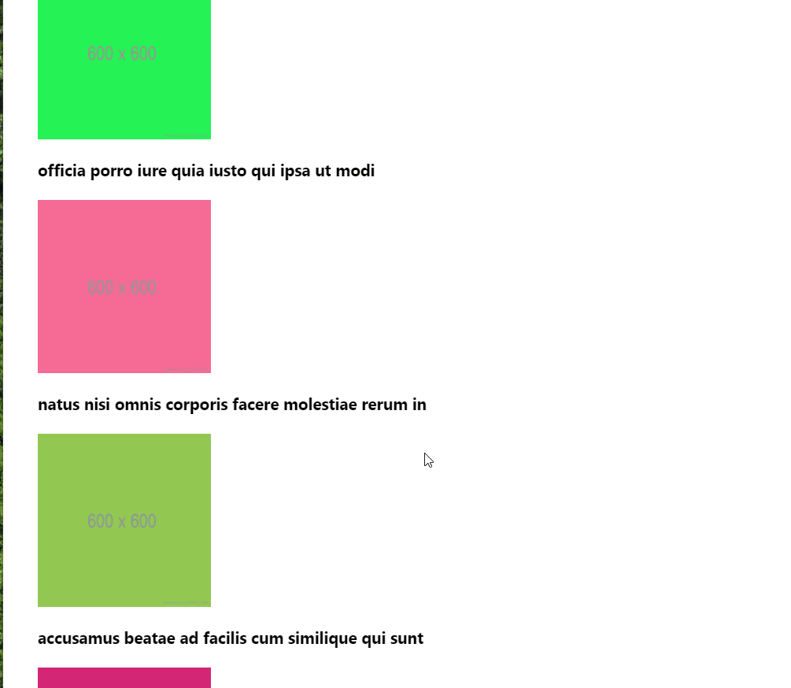

<h1 align="center"> Performance React </h1>

<h3> Performando lista de componentes com mais de 1.000 imagens com ReactJs </h3>

 

# Tópicos 🚀
 - Trabalhar com longas listas de elementos
 - Reduzir as renderizações com Memoization
 - Escapar das armadilhas da passagem de valores para as props
 - Tomar cuidado com os callbacks
 - Otimizar renderizações condicionais de componentes
